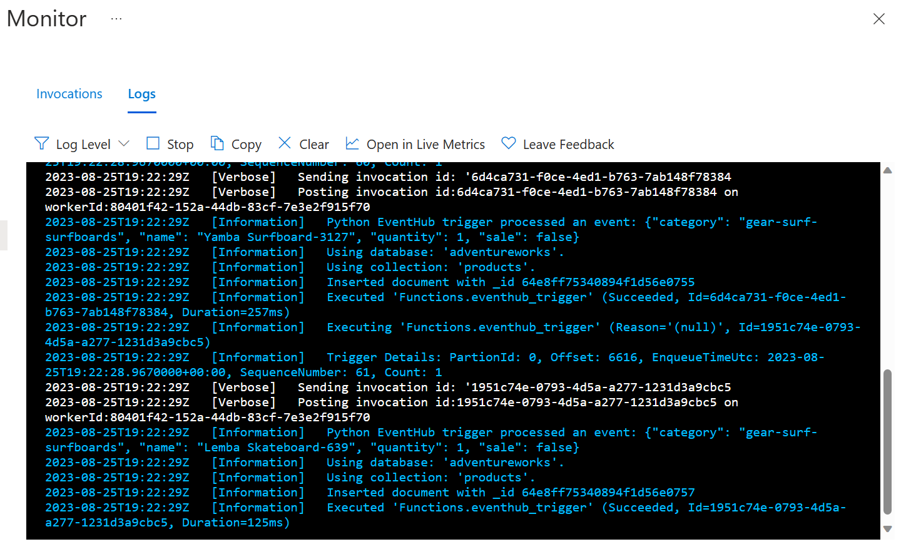

# Python Azure Functions (V2)<br>Event Hubs Trigger to ComosDB/MongoDB

A Python Azure function that triggers on Azure EventHubs messages and saves them to Cosmos MongoDB.

## Requirements

- Linux Azure Function
- Azure Event hubs
  - Create a hub
  - Create a listening policy
  - Create a sending policy
  - Record the full connection string and the keys for each policy
- CosmosDB MongoDB
  - Record the connection string

## Azure Function Creation

Create a function:

- <https://learn.microsoft.com/en-us/azure/azure-functions/create-first-function-vs-code-python?pivots=python-mode-decorators>

### Azure Functions V1 vs V2

- V1 functions depended on the `function.json` file for added configuration like cardinality.
- V2 functions rely on the signature decorator (see cardinality below).

### Cardinality

Some Azure functions, like the one for Event Hubs, support cardinality meaning that the function can process one message at a time or many messages in one invocation. The configurations look as follows:

- Many

```Python
# Azure Function V2 with cardinality many
@app.event_hub_message_trigger(arg_name="events", event_hub_name="hub1",
                               connection="EVENTHUB_STR", cardinality="many")
def eventhub_trigger(events: List[func.EventHubEvent]):
    for event in events:
        message_body: str = event.get_body().decode('utf-8')
        logging.info(
            'Python EventHub trigger processed an event: %s', message_body)
        product = json.loads(message_body)
        process_message(product, logging)
```

- One

```Python
# Azure Function V2 with cardinality one, the default
@app.event_hub_message_trigger(arg_name="event", event_hub_name="hub1",
                               connection="EVENTHUB_STR") 
def eventhub_trigger(event: func.EventHubEvent):
    # Get the string message from hub
    message_body : str = event.get_body().decode('utf-8')
    logging.info('Python EventHub trigger processed an event: %s',message_body)
    product = json.loads(msg)
    process_message(product,logging)
```

### Azure Function Python Support

- Max: 3.10
- Min: 3.6

## Local Development & Debugging

Environment:

- VS Code
- VS Code Azure Function App extension
- VS Code Azurite (Storage Emulator) extension

Recommended:

- `virtualenv` or `pyenv`

### Debugging

- Create a `local.settings.json` file:

```json
{
  "IsEncrypted": false,
  "Values": {
    "FUNCTIONS_WORKER_RUNTIME": "python",
    "AzureWebJobsStorage": "UseDevelopmentStorage=true",
    "AzureWebJobsFeatureFlags": "EnableWorkerIndexing",
    "EVENTHUB_STR": "<FULL_SEND_POLICY_CONNECTION_STRING>"
  }
}
```

- Create a `.env` file and add the following key/value pairs:

```
MONGODB_CONNECTION_STRING=<COSMOS_MONGODB_CONNECTION_STRING>
DB_NAME=<MONGO_DB_NAME>
COLLECTION_NAME=<MONGO_COLLECTION_NAME>
```

- Start the storage emulator
  -  From VS Code type, `F1` and look for `azurite: Start`
- If you created the Python project from VS Code, it should be configured for you to debug
- From VS Code press: `F5`

## Deploying to Azure

- Create an Azure Function consumption plan
  - When creating the app, make sure to add a storage and Application Insights
- Deploy the app from VS Code
- In the Azure Portal for the function app settings create/override the following settings:

```bash
EVENTHUB_STR=<FULL_LISTEN_POLICY_CONNECTION_STRING>
MONGODB_CONNECTION_STRING=<COSMOS_MONGODB_CONNECTION_STRING>
DB_NAME=<MONGO_DB_NAME>
COLLECTION_NAME=<MONGO_COLLECTION_NAME>
```

## Expected Logs


